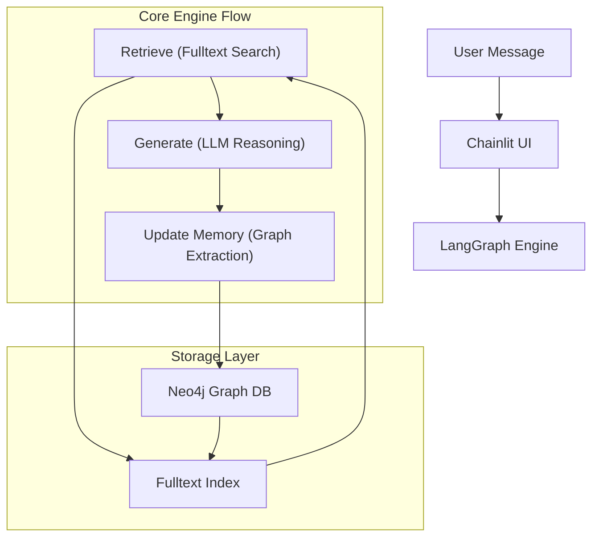

# 🧠 fqylearning: Graph-Centric Cognitive Engine

[](https://www.python.org/downloads/)
[](https://github.com/langchain-ai/langchain)
[](https://neo4j.com/)
[](https://ollama.com/)
[](https://opensource.org/licenses/MIT)

> "A Graph-Powered Cognitive Engine designed for continuous learning through structured knowledge extraction and relational reasoning."

---

## 🌊 核心概览 (Overview)

`fqylearning` 不仅仅是一个 RAG 系统，它是一个**自我进化的知识体系**。通过结合 **LangGraph** 的工作流编排与 **Neo4j** 的图数据存储，系统能够从每一次对话中提取实体（Entities）与关系（Relations），构建一个动态增长的语义网络，从而实现跨对话的长程记忆与复杂逻辑推理。

### ✨ 核心特性
- **图增强检索 (Graph-RAG)**：超越传统向量检索，利用知识图谱提供更具关联性的上下文。
- **自动知识提取**：利用 DeepSeek-R1 模型自动从对话文本中建模实体与其相互连接。
- **动态工作流**：基于 LangGraph 的状态机管理，确保对话、检索与存储逻辑的自洽。
- **毫秒级 UI 响应**：采用 Chainlit 构建，支持流式输出与实时状态展示。

---

## 🏗️ 架构可视化 (Architecture)



---

## 🧠 模块深度解析 (Module Deep Dive)

### 1. `src/memory.py` - 认知的基石 🧬
这是系统的“长期记忆”实现层。
- **设计哲学**：认为知识不是孤立的向量点，而是相互连接的网。系统将对话内容解构为**原子实体**（Entities）和**语义关系**（Relations）。
- **技术实现**：
    - **Pydantic 建模**：通过 `KnowledgeGraph` 模型强制输出结构化的三元组数据。
    - **原子化写入**：利用 Cypher 的 `MERGE` 语法确保实体的唯一性，避免重复构建冗余节点。
    - **全文本检索**：通过 `db.index.fulltext` 实现对节点名称和描述的模糊匹配，增强检索的鲁棒性。

### 2. `src/agent.py` - 思维的编排 🌊
定义了系统的状态转移逻辑。
- **生命周期**：
    1.  **Retrieve** (环境感知)：从图谱中调取相关背景知识。
    2.  **Generate** (思考响应)：结合上下文、历史消息与 LLM 推理生成回答。
    3.  **Update Memory** (经验总结)：将本次对话的精华沉淀为新的图谱节点。
- **健壮性设计**：采用 LangGraph 的状态管理，即使异步的记忆更新出现暂时延迟，也不会阻塞对话的主响应流。

### 3. `src/model.py` - 动力源泉 ⚡
- **推理引擎**: 默认使用 `deepseek-r1:8b` (通过 Ollama)，其强大的思维链（CoT）能力显著提升了知识提取的准确度。
- **嵌入模型**: 集成 `BAAI/bge-m3` 模型，通过 `HuggingFaceEmbeddings` 驱动，提供多语言支持和极高的语义区分度。

---

## 🛠️ 快速上手 (Quickstart)

### 1. 环境准备
确保已安装 [Ollama](https://ollama.com/) 并拉取所需模型：
```bash
ollama pull deepseek-r1:8b
```

### 2. 基础设施启动
推荐使用 Docker 一键启动 Neo4j 数据库：
```bash
docker-compose up -d
```

### 3. 环境配置
```bash
# 安装 Python 依赖
pip install -r requirements.txt

# 配置环境变量 (推荐写入 .env 文件)
export OLLAMA_BASE_URL="http://localhost:11434"
export NEO4J_URI="bolt://localhost:7687"
export NEO4J_PASSWORD="your_password"
```

> [!TIP]
> 默认配置适用于本地开发环境。若需生产环境部署，建议调整 `src/config.py` 中的连接池参数。

### 4. 运行应用
```bash
chainlit run app.py -w
```
访问 `http://localhost:8000` 即可开始与您的图谱引擎对话。

---

## 📂 目录结构 (Directory)
```text
.
├── app.py              # 程序入口 (Chainlit UI)
├── src/
│   ├── agent.py        # LangGraph 工作流编排
│   ├── memory.py       # 知识提取、存储与检索逻辑
│   ├── model.py        # LLM 与 Embedding 模型加载
│   ├── graph_db.py     # Neo4j 驱动封装
│   └── config.py        # 全局配置管理
├── requirements.txt    # 核心依赖清单
└── docker-compose.yml  # 基础设施编排 (Neo4j)
```

---

## 📅 生命周期 (Lifecycle)

1.  **初始化**：启动时调用 `init_indexes()` 确保 Neo4j 全文本索引就绪。
2.  **触发**：用户输入消息。
3.  **循环**：检索图谱 -> 生成回答 -> 异步提取知识 -> 持久化。
4.  **持续演进**：随着交流深入，图谱规模自动扩大，系统回答将愈发精确。

---

> 🛸 Crafted with precision by **Antigravity SOP**.
